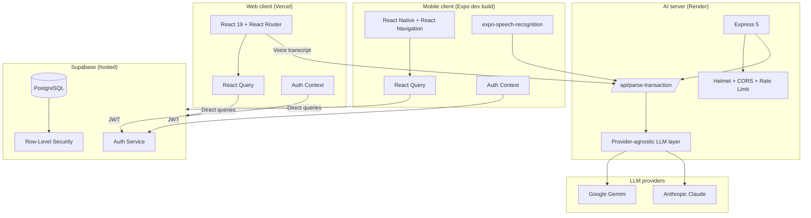
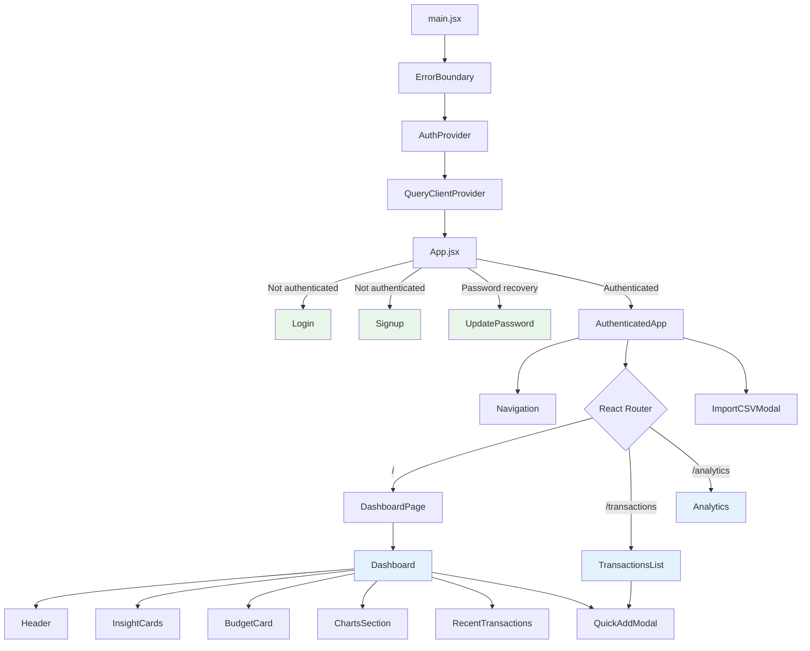
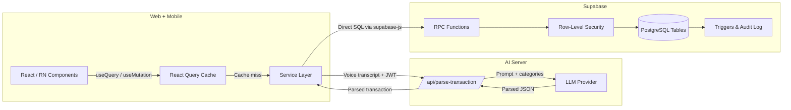
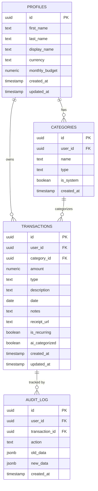
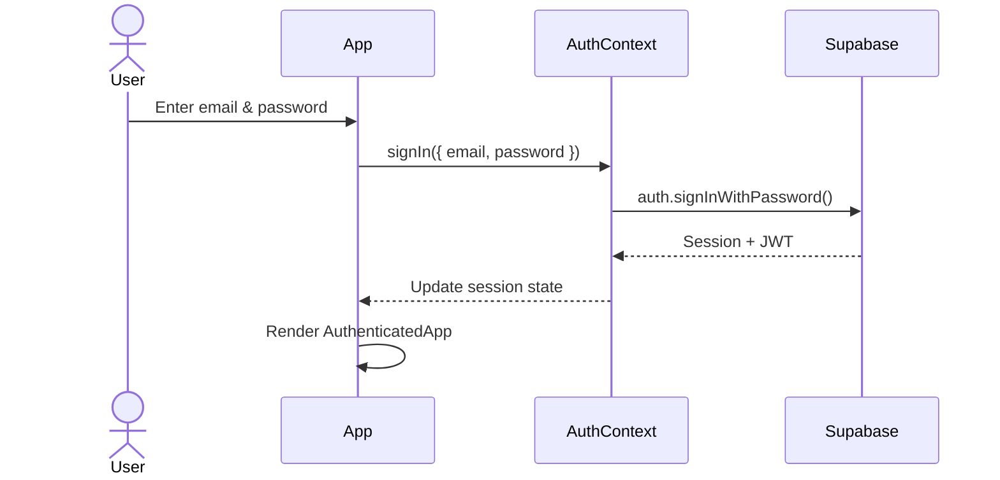
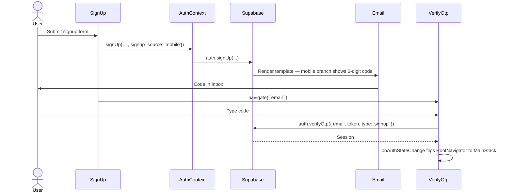
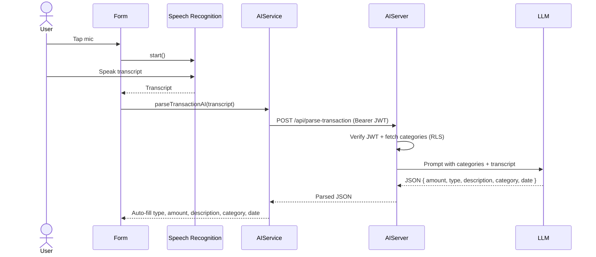
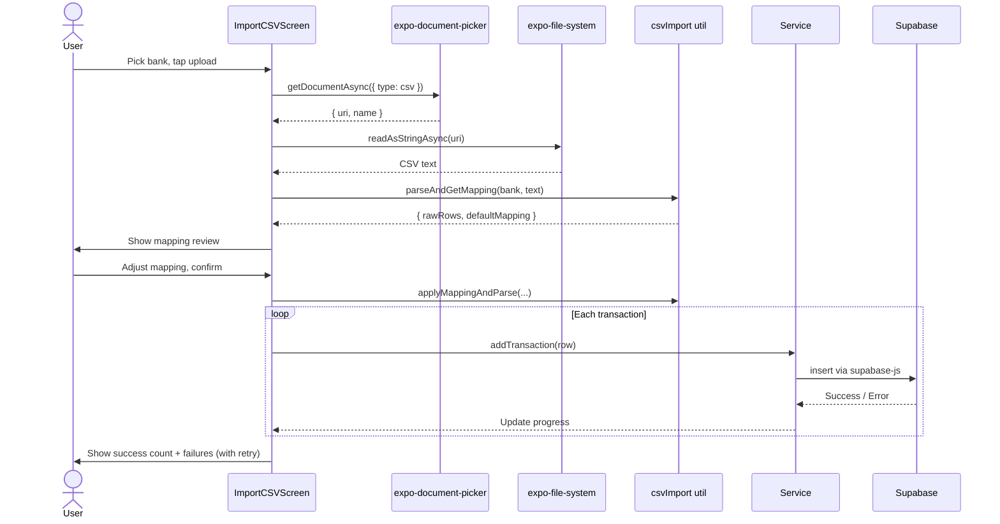

# Personal Finance Tracker

**A full-stack personal finance app with a React web client, a React Native + Expo mobile companion, Supabase + RLS as the data layer, and a thin Node.js AI server that turns spoken English into structured transactions.**

> Built as a portfolio piece demonstrating end-to-end product ownership: auth, data security, mobile + web parity, voice-to-text → LLM parsing, deployment, and the engineering judgment to *remove* the GraphQL layer when it stopped earning its keep.

**Live Demo:** [personal-finance-tracker.vercel.app](https://personal-finance-tracker-flnt5ffi8-shivaninrs-projects.vercel.app)

## Demo

<!-- TODO: Add a short demo video (Loom, YouTube, or MP4) -->
<!-- [](https://your-demo-video-url) -->
> Demo video coming soon.

## Table of Contents

- [Why This Project](#why-this-project)
- [What Makes This Stand Out](#what-makes-this-stand-out)
- [Screenshots](#screenshots)
- [Tech Stack](#tech-stack)
- [Features](#features)
- [Architecture](#architecture)
- [Component Diagram (Web)](#component-diagram-web)
- [Data Flow](#data-flow)
- [Database Schema](#database-schema)
- [Sequence Diagrams](#sequence-diagrams)
- [Key Challenges Solved](#key-challenges-solved)
- [What I'd Improve Next](#what-id-improve-next)
- [Project Structure](#project-structure)
- [Getting Started](#getting-started)
- [Deployment](#deployment)
- [Environment Variables](#environment-variables)

## Why This Project

Most finance tracker tutorials stop at basic CRUD. This project goes further by solving **real user pain points** across both web and mobile:

- **Manual entry is tedious** — voice input + LLM parsing + CSV bank statement import eliminate repetitive data entry
- **Spending is invisible** — interactive dashboards with category breakdowns and trend charts make spending patterns visible at a glance
- **Budgets are forgotten** — budget gauge and insight cards proactively surface saving opportunities and spending anomalies
- **Data is insecure** — Row-Level Security ensures every user only sees their own data, with JWT auth and rate limiting

## What Makes This Stand Out

**Product thinking:**
- A real cross-device flow: same user, same data, same charts on web and on a native Android dev build
- Multi-stage CSV import wizard with bank-specific parsing and category mapping (both on web and mobile)
- Actionable insights — saving tips, top-category breakdown, spending vs. income gauge

**Technical depth:**
- Supabase Postgres with **Row-Level Security**, triggers, and audit logging — every query enforced at the DB layer
- React Query for intelligent caching, background refetching, and optimistic UI on both clients
- Voice → LLM parsing pipeline (provider-agnostic: Gemini default, Anthropic supported via env var, no code change)
- OTP-based email confirmation tailored per client via `signup_source` metadata + Supabase Go-template conditional
- Custom EAS dev build of the mobile app with native speech recognition, document picker, and date picker
- Jest + jest-expo + Testing Library suite covering the mobile auth flow (32 tests), Vitest suite on the server (14 tests), Vitest + React Testing Library on the web

**Engineering judgment:**
- Originally built with an Apollo GraphQL middle tier; deliberately **removed it** once it was clear each resolver was a thin proxy doing what the Supabase JS client could do directly. ~1,800 lines of dead code gone, one fewer network hop, no capability lost.
- The remaining Node.js server exists for one reason: keeping the LLM API keys off the client.

**Deployment maturity:**
- Frontend on Vercel, backend on Render, database on Supabase
- Environment-based CORS configuration
- Health check endpoint for monitoring
- Error boundaries for graceful failure recovery

## Screenshots

### Dashboard
Real-time financial overview with balance, income/expense cards, monthly trend charts, category breakdown, and recent transactions.

<!-- TODO: Replace with actual screenshot -->
<!--  -->

### CSV Import Workflow
Multi-stage import: select bank → upload file → review category mapping → import with progress + retry. Available on both web and mobile.

<!-- TODO: Replace with actual screenshots -->

### Transaction Management
Edit transactions with type toggle, amount, description, category chips, and voice input — all auto-filled by the LLM when you speak.

<!-- TODO: Replace with actual screenshot -->

### Analytics
Multi-view analytics with overview, category breakdown, and trend charts — all with time range filtering. Touch-following tooltips on mobile chart lines.

<!-- TODO: Replace with actual screenshot -->

## Tech Stack

| Layer | Technology |
|-------|-----------|
| **Web frontend** | React 19, React Router 7, TanStack React Query 5 |
| **Mobile frontend** | React Native + Expo SDK 54, React Navigation, React Query, Custom EAS dev build |
| **UI / Charts (web)** | Recharts, Lucide Icons, PrimeReact, Sonner (toasts) |
| **UI / Charts (mobile)** | react-native-gifted-charts, @expo/vector-icons |
| **AI server** | Node.js, Express 5 — sole purpose: keep LLM API keys server-side |
| **LLM providers** | Google Gemini (default) or Anthropic Claude, selected via `LLM_PROVIDER` env var |
| **Voice input** | `webkitSpeechRecognition` (web), `expo-speech-recognition` (mobile, dev build) |
| **Database** | Supabase (PostgreSQL) with Row-Level Security |
| **Authentication** | Supabase Auth (email/password); OTP confirmation on mobile, link confirmation on web |
| **Security** | Helmet, CORS, rate limiting (100 req / 15 min), RLS policies |
| **Build tools** | Vite (web), Metro + EAS (mobile) |
| **Deployment** | Vercel (web), Render (server), EAS Build (mobile dev client), Supabase (DB + Auth) |

## Features

### Authentication & Security
- Email/password signup and login on web and mobile
- **OTP-based email confirmation on mobile** (6-digit code) and **link-based confirmation on web** — Supabase email template branches on `signup_source` metadata so each platform shows only its relevant surface
- Web: forgot-password recovery flow
- Row-Level Security — users can only access their own data
- JWT-based API authentication
- Rate limiting (100 requests per 15 minutes)

### Dashboard
- Total balance, monthly income, and expense overview
- Budget tracking with visual gauge (expense % of income)
- Insight cards with spending patterns and saving tips
- Interactive charts (category breakdown, monthly trends) — touch-following tooltips on mobile
- Recent transactions with quick navigation
- Time range filtering (this month, last 3/6 months)

### Transaction Management
- Add, edit, and delete transactions on both clients
- Web: search by description, filter by type, sort by date/amount, pagination
- Voice input with speech-to-text → LLM parsing → auto-filled form
- Category assignment (13 default + custom categories, filtered by transaction type on mobile)

### CSV Bank Statement Import
- Multi-stage import wizard: select bank → upload → mapping review → import → done/retry
- Bank-specific parsers (Discover format supported)
- Category mapping during import with bank-aware sub-splitting (e.g., Travel/Entertainment → rides vs other)
- Per-row error handling with retry-failed support
- Available on web (drag-and-drop) and mobile (document picker)

### Analytics
- **Overview**: income vs expenses chart with touch-tracking tooltips
- **Categories**: top spending categories bar chart with value labels
- **Trends**: net balance line chart over time
- Time range filtering synced across views

### Mobile-specific
- **Profile screen** at top-right with Import CSV, Budget setting, and Sign out
- **OTP confirmation** screen with resend + cooldown
- **Voice mic** next to the description input on the transaction form
- **Native date picker** for transaction date
- **Pull-to-refresh** on transactions list and dashboard

## Architecture



## Component Diagram (Web)



## Data Flow



## Database Schema



### Database features
- **Row-Level Security**: every table enforced — users only see their own data
- **Auto-triggers**: profile creation on signup seeds 13 default categories
- **Audit logging**: all transaction INSERT/UPDATE/DELETE operations logged with old/new data
- **RPC functions**: `get_dashboard_data`, `get_category_spending`, `get_monthly_trends`, `get_user_categories`

## Sequence Diagrams

### Web authentication



### Mobile OTP signup confirmation



### Voice → AI parse → form auto-fill



### CSV import (mobile)



## Key Challenges Solved

| Challenge | Solution |
|-----------|----------|
| **Date timezone bug** | `toISOString()` shifted dates by a day due to UTC conversion. Built a `localDateString()` helper using local date components instead — applied symmetrically in web and mobile so server-side AI parsing also resolves "today" in the user's timezone. |
| **GraphQL layer that wasn't pulling its weight** | The Apollo middle tier was duplicating what the Supabase JS client + RLS already gave us. Made the engineering call to remove it (~1,800 lines deleted), keeping only a thin Node server for the AI endpoint where the LLM keys actually need to live. |
| **Email-link confirmation breaks on mobile** | A mobile signup that gets back a *web URL* to click is a dead-end UX. Tagged each signup with `signup_source` metadata and added a Go-template conditional in the Supabase confirm-signup email so mobile users get a 6-digit OTP code and web users get the link — both delivered by the same template. |
| **Charts looked squished on small screens** | gifted-charts auto-sizes to data when no width is set; on a phone with 1 data point that means everything bunches up at the left edge. Pinned chart width to screen size and used `adjustToWidth` so axes always span the full card. |
| **Voice in a "managed" Expo app** | `expo-speech-recognition` isn't bundled in Expo Go. Wrote a `useVoiceInput` hook that `try { require(...) }`-guards the native import so Expo Go still runs the rest of the app while the dev build gets the voice path. |
| **CSV category mismatch** | Bank categories (e.g., "Merchandise") don't match app categories (e.g., "Shopping"). Built a mapping review step on both clients so users can correct categories before importing, including bank-aware sub-splitting for Discover's `Travel/Entertainment` (rides vs other). |
| **Analytics filtering was cosmetic** | Time-range selector existed but didn't filter data. Rewired Analytics to fetch its own data with date parameters via `useQuery`. |

## What I'd Improve Next

- **Universal Links / App Links** — replace the OTP-only flow on mobile with a same-URL-for-everyone flow once a custom domain exists
- **Mobile password reset** — deep-link based, mirroring the web flow
- **TypeScript migration** — incremental (`allowJs: true`), starting with the service layer
- **CI for mobile** — run the Jest suite alongside the existing web CI
- **AI auto-categorization** — use the LLM to assign categories during CSV import based on description patterns, with user correction
- **Natural language search** — "show me dining expenses last month" parsed into filtered queries
- **Spending anomaly alerts** — surface unusual spending patterns
- **E2E testing** — Playwright (web) and Maestro (mobile)
- **Accessibility audit** — ARIA labels, keyboard navigation, focus management
- **Performance** — code splitting on web, virtualized lists for long transaction histories

## Project Structure

```
Personal-Finance-Tracker/
├── client/                              # React web client (Vite)
│   ├── src/
│   │   ├── components/                  # Dashboard, Analytics, ImportCSVModal, QuickModal, ...
│   │   ├── context/AuthContext.jsx      # Supabase auth state
│   │   ├── lib/supabase.js              # Browser Supabase client
│   │   ├── services/                    # Direct-Supabase data layer + ai.js
│   │   ├── utils/                       # dateRanges, csvImport + parsers
│   │   ├── App.jsx                      # Root with routing
│   │   └── main.jsx                     # Entry point
│   └── vite.config.js
│
├── mobile/                              # React Native + Expo client (SDK 54)
│   ├── App.js                           # Providers + RootNavigator
│   ├── app.json                         # Expo config (incl. expo-speech-recognition plugin)
│   ├── eas.json                         # EAS dev build config
│   ├── src/
│   │   ├── lib/supabase.js              # RN Supabase client (AsyncStorage + AppState)
│   │   ├── context/AuthContext.js       # Mirrors web; passes signup_source: 'mobile'
│   │   ├── navigation/                  # RootNavigator, AuthNavigator, MainStack, MainTabs
│   │   ├── screens/                     # Dashboard, Transactions, Analytics, TransactionForm,
│   │   │                                # Profile, BudgetSetting, ImportCSV, auth/*
│   │   ├── services/                    # Ported from web (transactions, categories, dashboard, ai)
│   │   ├── hooks/                       # useTransactions, useCategories, useDashboard, useVoiceInput
│   │   ├── components/                  # dashboard/* and analytics/* chart blocks, TimeRangePicker
│   │   └── utils/                       # dateRanges, csvImport + parsers, format
│   ├── jest.config.js                   # jest-expo preset
│   └── jest.setup.js
│
├── server/                              # Slim Express AI server
│   ├── src/index.js                     # Express + helmet + CORS + rate-limit + /api/parse-transaction
│   └── services/
│       ├── supabase.js                  # Admin + user-scoped clients
│       ├── ai.js                        # parseTransaction(text, categories, today)
│       └── llm/                         # Provider-agnostic layer (Gemini / Anthropic)
│
├── supabase/migrations/                 # Database schema
│   ├── 001_create_tables.sql            # Tables, indexes, enums
│   ├── 002_rls_policies.sql             # Row-Level Security
│   ├── 003_triggers.sql                 # Auto-triggers & audit
│   └── 004_rpc_functions.sql            # Server-side functions
│
├── CLAUDE.md                            # Working-with-the-codebase guide for Claude Code
└── README.md
```

## Getting Started

### Prerequisites
- Node.js v18+
- A [Supabase](https://supabase.com) project (free tier is fine)
- npm
- (Mobile only) An [Expo](https://expo.dev) account for EAS builds

### Installation

```bash
git clone https://github.com/ShivaniNR/Personal-Finance-Tracker.git
cd Personal-Finance-Tracker

# Server (only needed if you want voice / AI parsing)
cd server && npm install

# Web client
cd ../client && npm install

# Mobile client (optional)
cd ../mobile && npm install
```

### Database setup

Run these migrations in order in the Supabase SQL Editor:
1. `supabase/migrations/001_create_tables.sql`
2. `supabase/migrations/002_rls_policies.sql`
3. `supabase/migrations/003_triggers.sql`
4. `supabase/migrations/004_rpc_functions.sql`

### Running locally

**Web:**
```bash
# Terminal 1
cd server && npm run dev     # http://localhost:4000

# Terminal 2
cd client && npm run dev     # http://localhost:5173
```

**Mobile (Expo Go for everything except voice):**
```bash
cd mobile
npx expo start
# Scan the QR with the Expo Go app
```

**Mobile (custom dev build for voice + CSV pickers):**
```bash
cd mobile
eas build --profile development --platform android   # ~15-20 min, cloud build
# Install the resulting APK on your phone, then:
npx expo start --dev-client
```

## Deployment

| Service | Platform | Root Directory |
|---------|----------|---------------|
| Web frontend | [Vercel](https://vercel.com) | `client` |
| AI server | [Render](https://render.com) | `server` |
| Mobile dev/prod builds | [EAS Build](https://expo.dev/eas) | `mobile` |
| Database + Auth | [Supabase](https://supabase.com) | Hosted |

### Post-deployment checklist
- Set `ALLOWED_ORIGINS` on Render to your Vercel URL
- Update Supabase **Site URL** and **Redirect URLs** in Authentication settings (production domain only; preview URLs are auth-walled by Vercel)
- Verify the `/health` endpoint on Render returns `{ status: "healthy" }`
- Update the Supabase "Confirm signup" email template to use the `signup_source` Go-template branch so mobile gets a code and web gets a link
- For mobile, set `EXPO_PUBLIC_API_URL` to your deployed Render URL (a physical device can't reach your laptop's `localhost`)

## Environment Variables

### Web client (`client/.env`)

```env
VITE_SUPABASE_URL=your_supabase_project_url
VITE_SUPABASE_ANON_KEY=your_supabase_anon_key
VITE_API_URL=http://localhost:4000
```

### Mobile client (`mobile/.env`)

```env
EXPO_PUBLIC_SUPABASE_URL=your_supabase_project_url
EXPO_PUBLIC_SUPABASE_ANON_KEY=your_supabase_anon_key
EXPO_PUBLIC_API_URL=http://localhost:4000   # or your LAN IP / deployed Render URL for real devices
```

### Server (`server/.env`)

```env
NODE_ENV=development
PORT=4000
SUPABASE_URL=your_supabase_project_url
SUPABASE_SERVICE_ROLE_KEY=your_supabase_service_role_key
SUPABASE_ANON_KEY=your_supabase_anon_key
ALLOWED_ORIGINS=http://localhost:5173,http://localhost:4173

# Pick one provider; the other can be left blank.
LLM_PROVIDER=gemini                       # or "anthropic"
GEMINI_API_KEY=your_gemini_api_key
ANTHROPIC_API_KEY=your_anthropic_api_key
# Optional:
GEMINI_MODEL=gemini-2.0-flash-exp
ANTHROPIC_MODEL=claude-sonnet-4-6
```

---

Built with React, React Native, Supabase, and a thin Express AI server.
