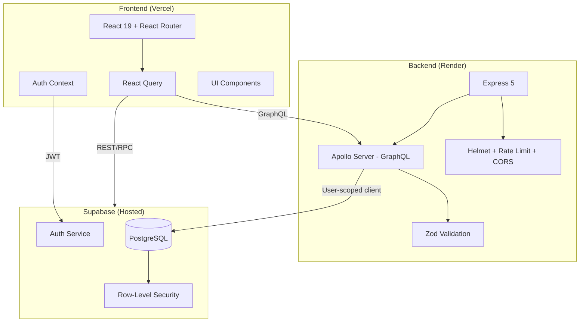
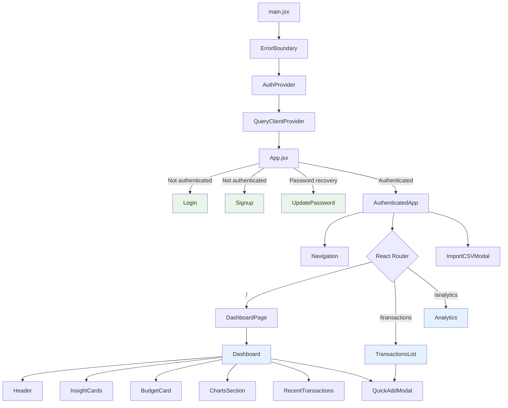
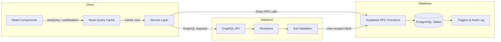
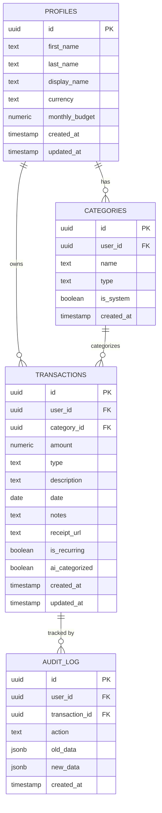
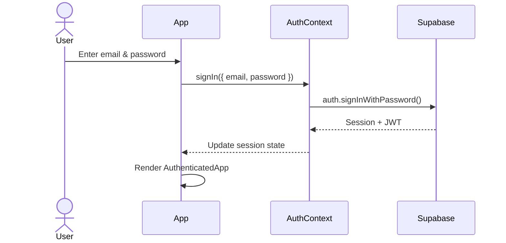
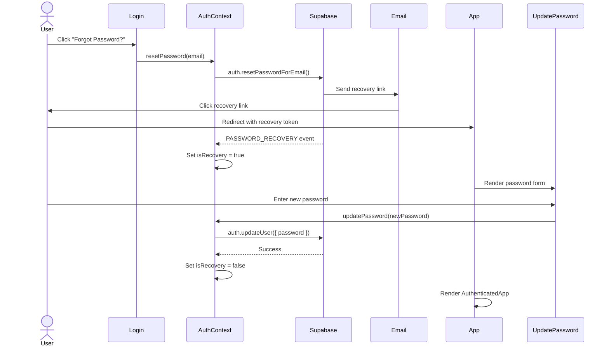
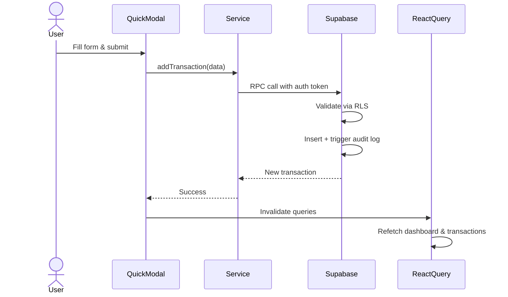
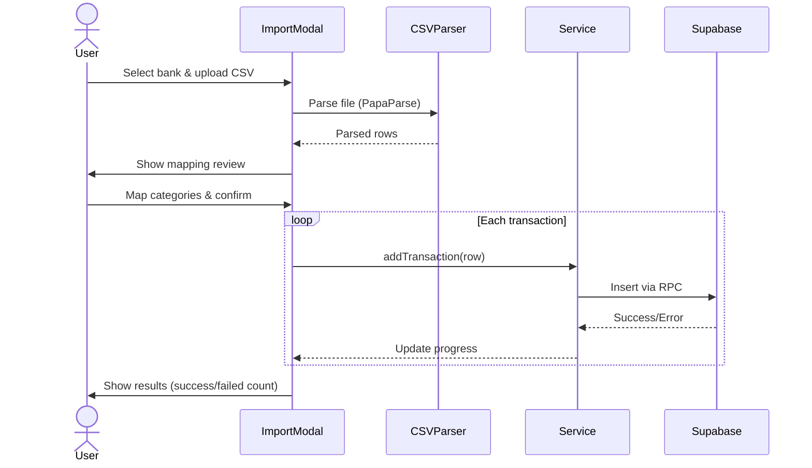

# Personal Finance Tracker

A full-stack personal finance management application with secure authentication, interactive dashboards, CSV bank statement imports, and voice-powered transaction entry.

**Live Demo:** [personal-finance-tracker.vercel.app](https://personal-finance-tracker-flnt5ffi8-shivaninrs-projects.vercel.app)

## Table of Contents

- [Tech Stack](#tech-stack)
- [Features](#features)
- [Architecture](#architecture)
- [Component Diagram](#component-diagram)
- [Data Flow](#data-flow)
- [Database Schema](#database-schema)
- [Sequence Diagrams](#sequence-diagrams)
- [Project Structure](#project-structure)
- [Getting Started](#getting-started)
- [Deployment](#deployment)
- [Environment Variables](#environment-variables)

## Tech Stack

| Layer | Technology |
|-------|-----------|
| **Frontend** | React 19, React Router 7, TanStack React Query 5 |
| **UI/Charts** | Recharts, Lucide Icons, PrimeReact, Sonner (toasts) |
| **Backend** | Node.js, Express 5, Apollo Server 4 (GraphQL) |
| **Database** | Supabase (PostgreSQL) with Row-Level Security |
| **Authentication** | Supabase Auth (email/password, password recovery) |
| **Validation** | Zod (server-side), HTML5 (client-side) |
| **Security** | Helmet, CORS, Rate Limiting, RLS policies |
| **Build Tool** | Vite |
| **Deployment** | Vercel (frontend), Render (backend) |

## Features

### Authentication & Security
- Email/password signup and login
- Forgot password with email recovery flow
- Row-Level Security — users can only access their own data
- JWT-based API authentication
- Rate limiting (100 requests per 15 minutes)

### Dashboard
- Total balance, monthly income, and expense overview
- Budget tracking with visual gauge (expense % of income)
- Insight cards with spending patterns and saving tips
- Interactive charts (category breakdown, monthly trends)
- Recent transactions with quick navigation
- Time range filtering (this month, last 3/6 months)

### Transaction Management
- Add, edit, and delete transactions
- Search by description, filter by type, sort by date/amount
- Pagination (20 items per page)
- Voice input with speech-to-text
- Category assignment (13 default + custom categories)

### CSV Bank Statement Import
- Multi-stage import wizard (upload -> map columns -> review -> import)
- Bank-specific parsers (Discover format supported)
- Category mapping during import
- Error handling with retry for failed rows

### Analytics
- **Overview**: Income vs expenses area chart, key metrics
- **Categories**: Top spending categories bar chart
- **Trends**: Balance, income, and expense line charts over time
- Time range filtering synced across views

### Responsive Design
- Mobile hamburger menu with overlay navigation
- Touch-friendly modals and forms
- Adaptive layouts for all screen sizes

## Architecture



## Component Diagram



## Data Flow



## Database Schema



### Database Features
- **Row-Level Security**: Every table enforced — users only see their own data
- **Auto-triggers**: Profile creation on signup seeds 13 default categories
- **Audit logging**: All transaction INSERT/UPDATE/DELETE operations logged with old/new data
- **RPC functions**: `get_dashboard_data`, `get_category_spending`, `get_monthly_trends`, `search_transactions`

## Sequence Diagrams

### Authentication Flow



### Password Recovery Flow



### Add Transaction Flow



### CSV Import Flow



## Project Structure

```
finance-tracker/
├── client/                     # React Frontend (Vite)
│   ├── src/
│   │   ├── components/
│   │   │   ├── Analytics.jsx         # Analytics page (overview, categories, trends)
│   │   │   ├── BudgetCard.jsx        # Monthly budget gauge
│   │   │   ├── ChartsSection.jsx     # Dashboard charts
│   │   │   ├── Dashboard.jsx         # Main dashboard page
│   │   │   ├── ErrorBoundary.jsx     # Error handling wrapper
│   │   │   ├── Header.jsx            # Balance/income/expense cards
│   │   │   ├── ImportCSVModal.jsx    # CSV import wizard
│   │   │   ├── InsightCards.jsx      # Spending insight cards
│   │   │   ├── Login.jsx             # Login form
│   │   │   ├── Navigation.jsx        # Sidebar navigation
│   │   │   ├── QuickModal.jsx        # Add/edit transaction modal
│   │   │   ├── recentTrasactions.jsx # Recent transactions widget
│   │   │   ├── Signup.jsx            # Registration form
│   │   │   ├── TimeRangeFilter.jsx   # Date range selector
│   │   │   ├── TransactionsList.jsx  # Full transaction list with pagination
│   │   │   └── UpdatePassword.jsx    # Password recovery form
│   │   ├── context/
│   │   │   └── AuthContext.jsx       # Authentication state management
│   │   ├── lib/
│   │   │   └── supabase.js          # Supabase client initialization
│   │   ├── services/
│   │   │   ├── categories.js        # Category API calls
│   │   │   ├── dashboard.js         # Dashboard data fetching
│   │   │   └── transactions.js      # Transaction CRUD operations
│   │   ├── utils/
│   │   │   ├── csvImport.js         # CSV parsing utilities
│   │   │   ├── dateRanges.js        # Date range calculations
│   │   │   └── parsers/             # Bank-specific CSV parsers
│   │   ├── App.jsx                  # Root app with routing
│   │   ├── App.css                  # Global styles
│   │   └── main.jsx                 # Entry point
│   ├── package.json
│   └── vite.config.js
│
├── server/                     # Node.js Backend
│   ├── src/
│   │   ├── index.js            # Express + Apollo Server setup
│   │   ├── schema.js           # GraphQL type definitions
│   │   └── resolvers.js        # GraphQL resolvers
│   ├── services/
│   │   ├── supabase.js         # Admin + user-scoped Supabase clients
│   │   └── validation.js       # Zod input validation schemas
│   └── package.json
│
├── supabase/                   # Database Migrations
│   └── migrations/
│       ├── 001_create_tables.sql     # Tables, indexes, enums
│       ├── 002_rls_policies.sql      # Row-Level Security
│       ├── 003_triggers.sql          # Auto-triggers (profile, categories, audit)
│       └── 004_rpc_functions.sql     # Server-side RPC functions
│
└── README.md
```

## Getting Started

### Prerequisites

- Node.js v18+
- A [Supabase](https://supabase.com) project
- npm

### Installation

```bash
# Clone the repository
git clone https://github.com/ShivaniNR/Personal-Finance-Tracker.git
cd Personal-Finance-Tracker

# Install server dependencies
cd server
npm install

# Install client dependencies
cd ../client
npm install
```

### Database Setup

1. Create a new project on [Supabase](https://supabase.com)
2. Run the migration files in order in the Supabase SQL Editor:
   - `supabase/migrations/001_create_tables.sql`
   - `supabase/migrations/002_rls_policies.sql`
   - `supabase/migrations/003_triggers.sql`
   - `supabase/migrations/004_rpc_functions.sql`

### Running Locally

```bash
# Terminal 1 — Start the server
cd server
npm run dev       # Runs on http://localhost:4000

# Terminal 2 — Start the client
cd client
npm run dev       # Runs on http://localhost:5173
```

## Deployment

| Service | Platform | Root Directory |
|---------|----------|---------------|
| Frontend | [Vercel](https://vercel.com) | `client` |
| Backend | [Render](https://render.com) | `server` |
| Database | [Supabase](https://supabase.com) | Hosted |

### Post-Deployment Checklist
- Set `ALLOWED_ORIGINS` on Render to your Vercel URL
- Update Supabase **Site URL** and **Redirect URLs** in Authentication settings
- Verify the `/health` endpoint on Render returns `{ status: "healthy" }`

## Environment Variables

### Client (`client/.env`)

```env
VITE_SUPABASE_URL=your_supabase_project_url
VITE_SUPABASE_ANON_KEY=your_supabase_anon_key
VITE_API_URL=http://localhost:4000
```

### Server (`server/.env`)

```env
NODE_ENV=development
PORT=4000
SUPABASE_URL=your_supabase_project_url
SUPABASE_SERVICE_ROLE_KEY=your_supabase_service_role_key
SUPABASE_ANON_KEY=your_supabase_anon_key
ALLOWED_ORIGINS=http://localhost:5173,http://localhost:4173
```

---

Built with React, Supabase, GraphQL, and Recharts.
